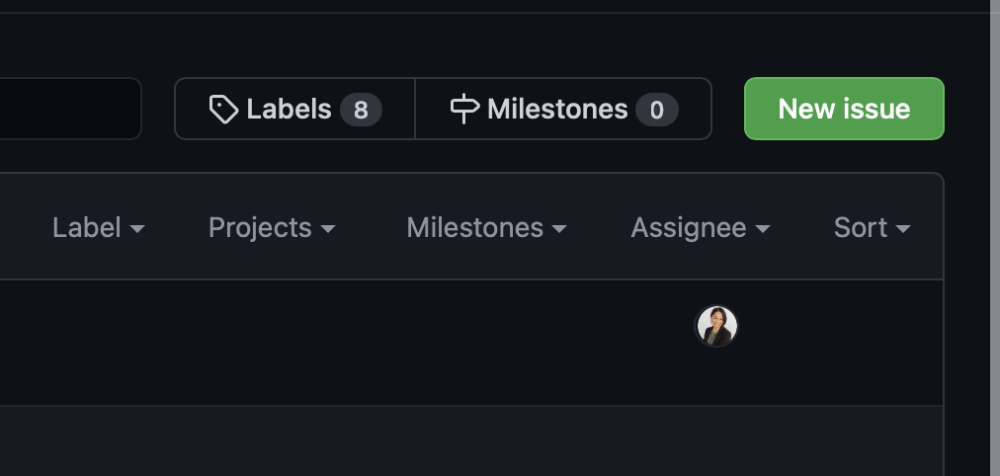
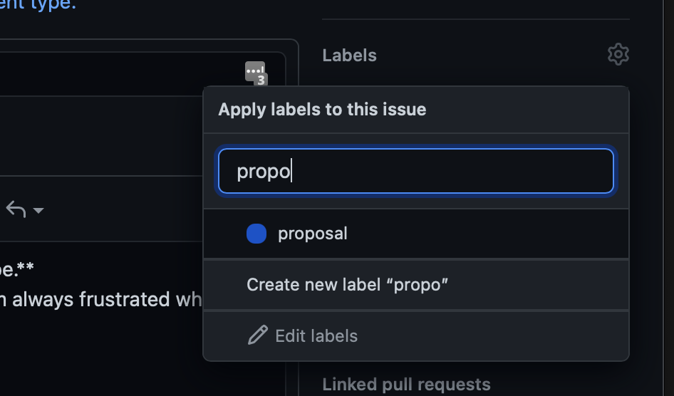
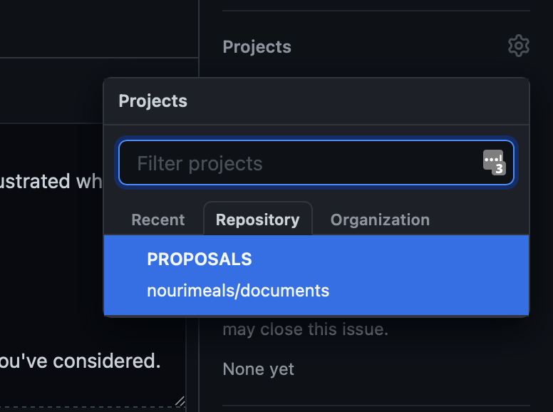
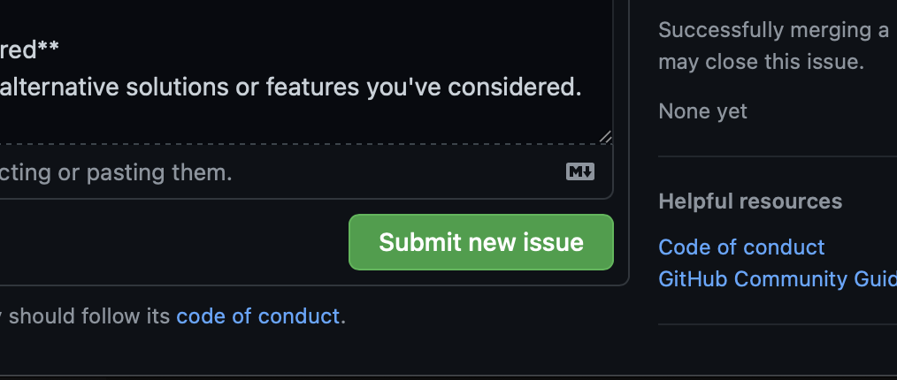
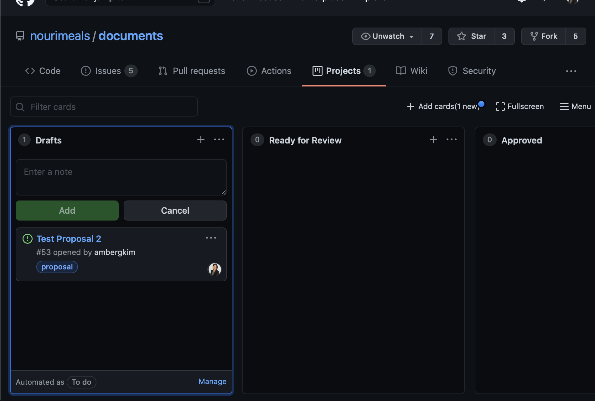
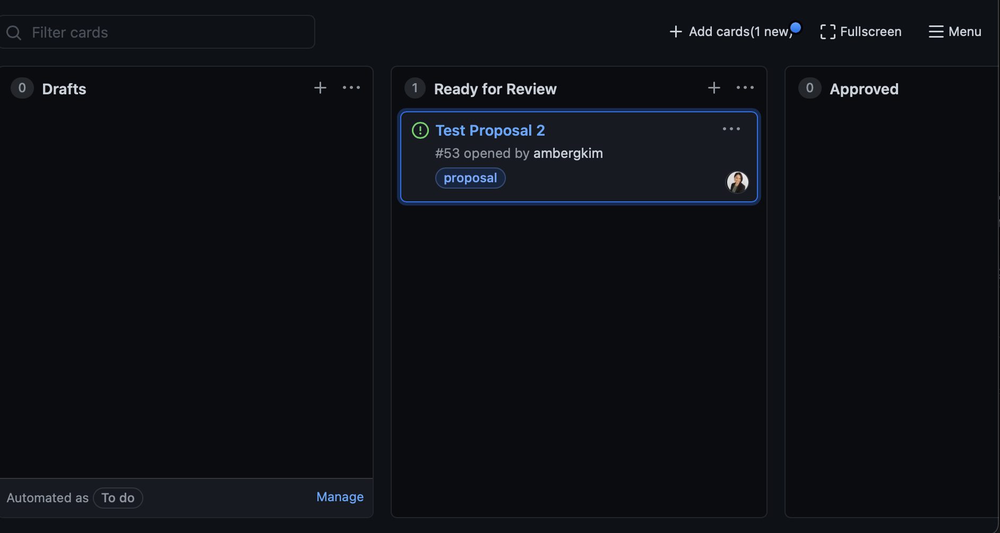
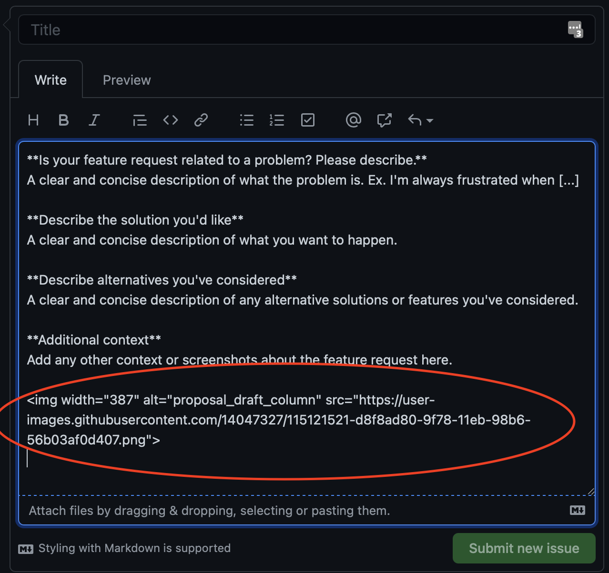

# How to Submit Proposals

If you have new ideas, designs, features, pivots and other things that need approval, you are in the right place.

You can find existing Proposals in our GitHub Project [here](https://github.com/nourimeals/documents/projects/1).

## Creating a New Proposal

1. Go to our GitHub Issues [here](https://github.com/nourimeals/documents/issues).
2. Click on the New Issue button.

3. Choose the Get Started button for the Feature Request.

4. Put a descriptive title and use the template as a guide for ideas on how to approach describing your feature request.

5. Assign the issue to yourself

6. Add the ``proposal`` label to your issue.

7. Add your issue to the ``Proposal`` project.

8. Click ``Submit new issue``.

9. If you've added your issue to the Proposal project correctly, you should see it in the project's Draft column [here](https://github.com/nourimeals/documents/projects/1).

10. Once you're done editing your proposal and you're ready to get it reviewed, you can drag your card to the ``Ready for review`` column.

11. Share the link to your proposal to the team in Slack in the appropriate channel(s).

## Editing your proposal

- When you're editing your proposal, you can add images by dragging and dropping the image into the text editor. Once it's done uploading, text like this should show up. If you want to place your image at a different spot in your document, just copy/cut and paste the text in the new place.

You should also be able to add gif animations here.

- The GitHub text editor also supports markdown. You can find the GitHub guide [here](https://guides.github.com/features/mastering-markdown/).

- For videos to show screensharing explanations, you can try embedding or linking to it in your issue.